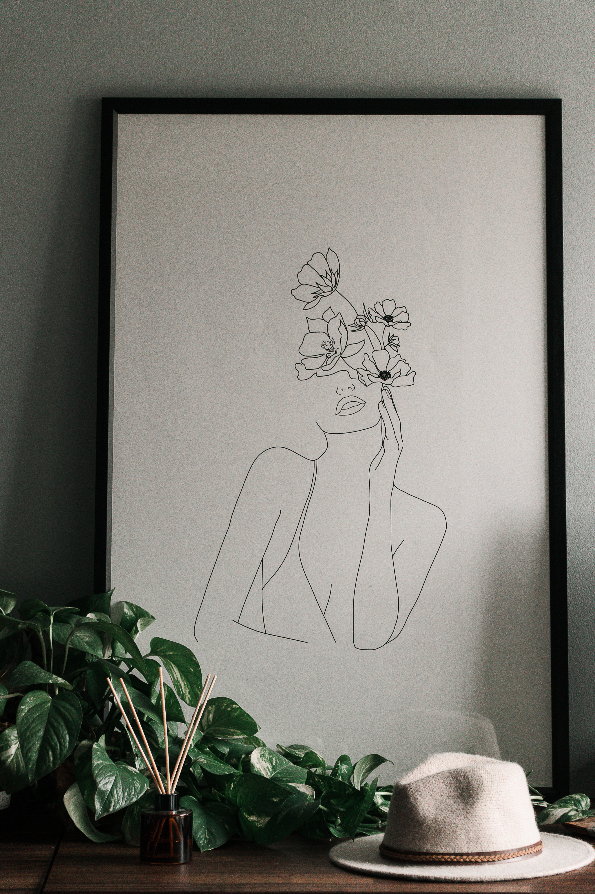
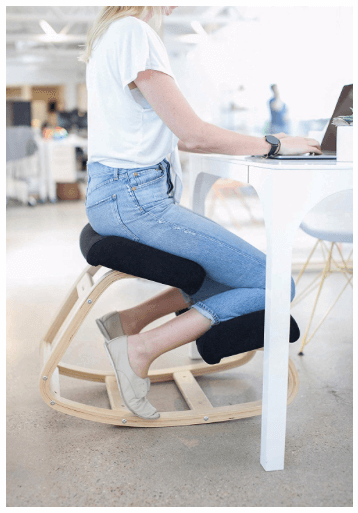

As business owners and entrepreneurs, we know how important it is to have a workspace that we actually want to use. Do you? Think about it. It’s where the majority of our time is spent throughout the day, and where the magic is supposed to happen. If our workspace doesn’t encourage the drive we have for our businesses, it’ll hurt us in the work and content we produce. Whether you have an office away from home or you’re setting up shop at your kitchen table, here are some ways to make sure your workspace inspires productivity and creativity.

### 1. Keep your space minimal and clean

While this seems like a no-brainer, it can be hard to maintain. A cluttered space causes a cluttered you. Besides the obvious, what does “clutter” look like?

- The “work” that has nothing to do with your business, i.e. house bills, a reminder to make a doctor’s appointment. Keep all other work away from this space.
- The 300 pictures, quotes, and trinkets that you have surrounded yourself with. Are they actually inspiring, or have they become distracting and stressful?
- The 3 dirty coffee mugs that have been sitting there for a week. We’re ashamed of it too. It’s gross.

### 2. Surround yourself with a few things you’re inspired by

Again, you shouldn’t line your desk with adorable little porcelain houses just because they’re cute. Are they adding value to your day? Instead of filling your desk, pick a few works of art or quotes that you love and use that vertical space. For us, this means an oil diffuser, a plant that adds some freshness and life to the space, and a framed piece that we found via [Society 6](https://society6.com) (seriously, the best stuff is on there).

### 3. Remember your body

Invest in an office chair that supports your back and doesn’t make you want to slouch all day. You may even want to consider a [kneeling, ergonomic chair](https://www.amazon.com/Sleekform-Ergonomic-Kneeling-Correcting-Orthopedic/dp/B0773PMT29/ref=sr_1_1_sspa?keywords=ergonomic+kneeling+chair&qid=1582848674&s=home-garden&sr=1-1-spons&psc=1&spLa=ZW5jcnlwdGVkUXVhbGlmaWVyPUExMzBYWlVRRktTVlNTJmVuY3J5cHRlZElkPUExMDAzMTU4MkQyWE9NNTIzQUFYOSZlbmNyeXB0ZWRBZElkPUEwMjU1MDUwM0RDVjAxN05RMEUzWiZ3aWRnZXROYW1lPXNwX2F0ZiZhY3Rpb249Y2xpY2tSZWRpcmVjdCZkb05vdExvZ0NsaWNrPXRydWU=) to encourage you to sit up straight and minimize back pain. Another office accessory that we seriously recommend is a [laptop stand](https://www.amazon.com/gp/product/B07D74DT3B/ref=ppx_yo_dt_b_asin_title_o05_s00?ie=UTF8&psc=1) or monitor stand. Say goodbye to neck pain! By remembering your body while working, it won’t be yelling at you to take constant breaks.

### 4. Find the right tunes

Whether a true crime podcast or Queen, create or find a playlist that is the perfect mix of filling the quiet (unless you like it this way), while not being distracting. By having a playlist, you’re not wasting precious time by searching for the next listen. We are constantly adding songs to our office playlist - you can find it here on Spotify. It’s a mix of focus music that we find to encourage productivity and creativity. We would like to think we have pretty good music taste, but if you hate it, no hard feelings.

<iframe
  src="https://open.spotify.com/embed/playlist/4zIGluSwnioIWHPFplEtZI"
  width="100%"
  height="380"
  frameborder="0"
  allowtransparency="true"
  allow="encrypted-media"
  style="margin-bottom: 3rem;"
></iframe>

### Investing in your workspace is investing in your biz.

Above all, your workspace should be somewhere that you love and gather inspiration from, whatever it looks like. Keeping it maintained and making it enjoyable for you while working is a priceless investment in your business. A happy and inspired you make big things happen.
