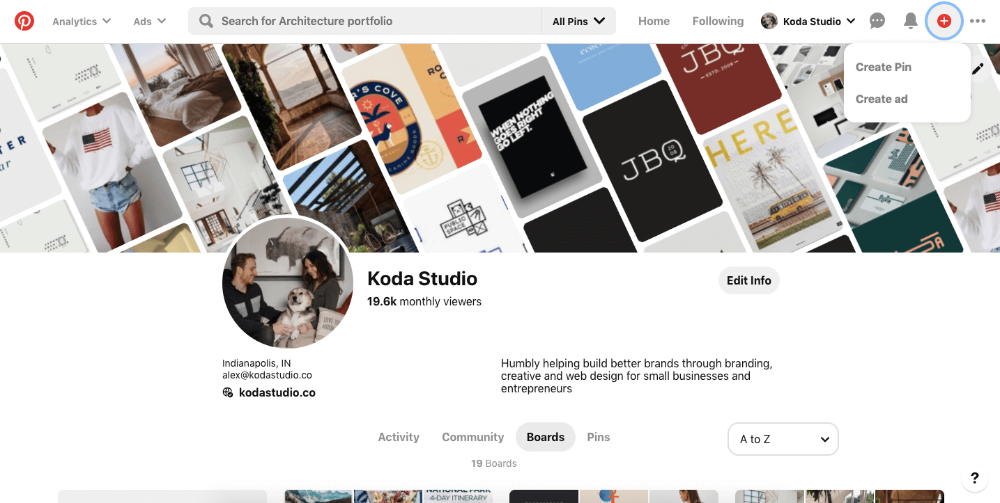
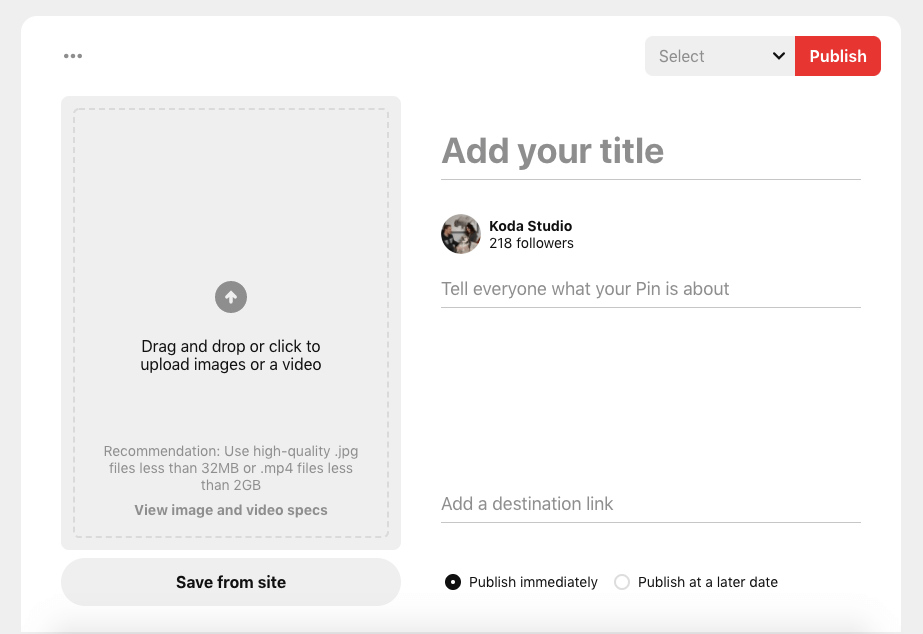

Free time has become a pretty common phenomenon lately. If you’re like us, you're enjoying the rest and relaxation piece of being at home, but feel like you want to use a little bit of the time to progress your business. Now is a killer time to dedicate even the tiniest bit of effort and love into your business. Here are a few easy things you can do to progress your business.

### Start or refine your brand strategy

Your brand strategy is an important part of your business. It provides direction and purpose for the things you do, and the ways you operate. We have noticed that a majority of small businesses don’t have a brand strategy because of the price tag that can come along with it. However, there are lots of free resources available that can help you with this, including a [brand strategy starter guide](https://www.dropbox.com/sh/979bll0peljd2p1/AABMKoGeaSyFaDEoWRuB2Rk7a?dl=0) that we have created. It is a great time to sit down and really devote some energy to discover the mission, vision, and values behind your business by defining why you do what you do. Then, when it’s time to get your business up and running, you are able to create a strategic business plan that checks off your goals one by one.

### Create and plan social content

Crank out content! It’s a great time to thoughtfully plan and create content for Instagram, Pinterest, Facebook, Twitter, etc. When the world gets moving again, you can have weeks of content ready, and you don’t even have to think about social marketing so focus on getting back to business. Consider creating social templates that you can reuse and just switch out the copy - this is a great way to cut down on creation time in the future. Need some info on how to create content? [Read our blog on how to curate an Instagram feed](/blog/social-media/how-to-easily-curate-an-instagram-feed/) by planning multiple days worth of social posts.

### Start marketing on Pinterest

Honestly, this is the easiest and most mindless way to use your time effectively to boost your business. Pinning content on your business Pinterest account can be done while binging your latest pick on Netflix. Here's what you'll need to do:

1. Start by clicking on the red plus button and choosing “Create Pin”

2. Upload your photo and add a title. Choose what you think people would search for (look at our strategy below). 

3. In the description, use keyword phrases separated by periods to describe your photo. One strategy we use to come up with keyword results is to open a new Pinterest tab, and type in a few words. Voila! Pinterest generates a search results list that you can use as your keywords for the title and description of your pin.

4. Don’t forget to add a URL or destination link for your photo to lead to. We bounce between our website and Instagram—just wherever it makes sense to take someone.
5. Lastly, choose a board to publish your pin to.

Once you get the hang of it, we promise you’ll be flying through the uploading process.

### It’s okay to enjoy the slow

We have definitely seen a lot on social media about how now is the time to get 100 things accomplished and be your better self. If you have the mental and physical energy, go for it! If not, it’s okay to not feel productive and wanting to take your business by the horns right now. This list is meant to provide you with some easy things that you can do that won’t drain the mental tank, but you can still feel good about the progression of your business.