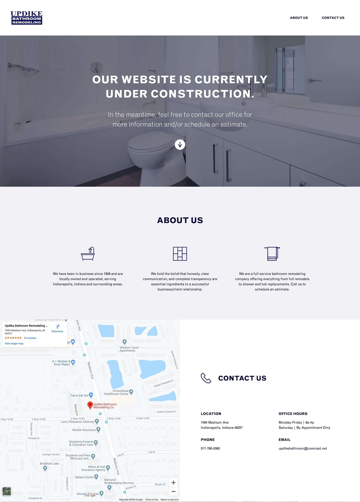

It's been a long while since we've heard someone make a case for why they don't *need* a website. For those who don't have an existing website, there's a pretty good consensus  that a website would be useful to their business. In our experience, the reason that a business may not have a website (or has long put off a website update) has more to do with a lack of time, knowledge, or budget than it does lack of desire. 

Designing and building a website takes an awful lot of time—and sometimes money. New services pop up everyday that can get you to where you want to be with your online presence. There's no shortage of options, but sometimes the number of choices makes picking a direction difficult. In our mind, the most realistic and practical—meaning they're worth your money—are using an online tool to build your website, or having it custom developed (a developer writes a bunch of code to make the website). There are some other options and services that "make you a website", but the two that we mentioned are the best directions in our experience.

### Online Tools vs. Custom Development

#### Online Tools

If you're a small business or an individual working to get yourself online, you've probably come across tools like Wix, Squarespace, or maybe even a newer tool called Webflow. Wix and Squarespace fall into what we would consider the "template" side of website building. These tools can be a great fit for some people—they allow you to get a professionally designed template personalized, loaded with your own content and brand, then get it live fairly quickly and at a fairly low cost. 

Another online website builder is Webflow. This is a more customized approach to using an online tool. You will have more control over building the website from scratch, and it's well suited for technically inclined people who like to get into the weeds with designing and building a website, without taking the time to write code.

#### Custom Development

Another option is to have your website custom developed. We'll go into more detail later about why we think it's often the best option for many businesses, but the basic idea is that anything is possible with a designer and developer calling the shots, and helping tailor your website to fit your exact needs. 

### Online tools—In Depth

#### Wix & Squarespace

Some people tend to stray away from templates because they want their website to be "one of a kind". But here's the thing—you're better off using a professionally designed template website than you are having no website at all. So if you know you are short on time or have very simple needs, it might be something worth considering. Once your website is live, you'll find that it's useful to your business, and you'll want to build more content and features. From there, you can begin considering other options. 

One thing that we would caution you about is to be careful when customizing the templates that you select as a starting point. A lot of the templates are strategically designed by professionals—they made the design choices that they made for good reasons. You can quickly water down the original design, and find that what you ended up with doesn't look nearly as good as the template you chose.

So, in our opinion, you should use tools like Wix and Squarespace to quickly add your logo, photos, and copywriting to a template, and be gentle with customizations.

#### Webflow

Webflow is a *very* cool tool. It's a bit of a new kid on the block in the online website builder scene, but it's much more user friendly and customizable than Wix or Squarespace. It feels a lot more like designing and building a website than just personalizing a template. It provides more flexibility with your design, and it often makes customization options more readily available to you. It does require a more technical person to use it efficiently, but if you are planning to design a website, you're likely technical enough to figure it out. The interface feels (to us, at least) familiar, being  reminiscent of any graphic design software that we've used. 

On top of the ease of starting from a blank canvas for design, you have a lot of options for functionality that we've found harder to access in other online website building platforms. Things like linking content together, adding uniquely responsive features, etc., are all more readily available—and you can definitely nerd out by adding custom code and more advanced content tools.

We have experience with Webflow, and we can confidently recommend it to use. It's a great option for people who don't have highly custom needs, but you know you need more than Wix or Squarespace can give you.

We think it's perfect for getting a good website at a good price—we like to recommend it to clients who come to us for a website, but don't need something fully developed. Alex is a pro at using Webflow, and we'd be happy to talk about whether it's a good fit for what you need or not.

### Custom Development—In Depth

#### Flexibility

Even a tool like Webflow can't always provide what you need. For a lot of businesses, there are custom integrations that you need to implement for your website. Examples would be online scheduling tools, connected calendars to show availability, or online stores are just a few examples of why you might need something a bit more robust.

In cases when you need more, custom development is likely your answer. Most websites that you use everyday have been developed by writing code, rather than an online website builder. This is partially due to the fact that these tools haven't always existed and partially due to the fact that custom development is more flexible.  

#### Performance

The goal of your website is to provide information about your business. Your online audience shouldn't have to wait for this content to load. So, make it fast. This is also something that Google has been prioritizing more and more as an SEO factor. If your website is fast and it performs just like you would expect it to, it's a good website to recommend to someone, right? Google tends to think so, and you can learn more about their opinions on website performance on their website.

#### Search Engine Optimization (SEO)

A big draw to most businesses is the search engine optimization (SEO) benefits that custom development offers. For those who aren't up with the website lingo, it just means "how much does Google like me?" 

This is less of a factor for some people, as not everyone needs to rank #1 on Google results for their industry. Sometimes, you need a website to showcase work, or act as a brand validation tool for prospective clients. Brand validation is just a fancy way to say that people like to ask the internet "*is this business any good?*", and you want your website to answer that question enthusiastically, and positively.

If SEO is an important factor when answering "*why do you need a website?",* then custom development offers a lot of power behind making sure that Google likes you. With having your website custom developed, you'll have a lot of control over the nitty gritty SEO factors of your website.

### Your needs are unique

As you think about your website's needs, it's all about finding the right fit for you and your business. Each direction has it's own benefits and pitfalls, and it can be tricky to navigate. Hopefully, you've gotten a good idea of the different options you have when it comes to an online presence. 

If you still aren't sure, we're happy to help you figure it out. We've built websites using all of the options above, and will be honest about which one we think is right for you. Whether we're going to help you with the project or not, we always want to help small businesses and entrepreneurs take the guesswork out of the web.