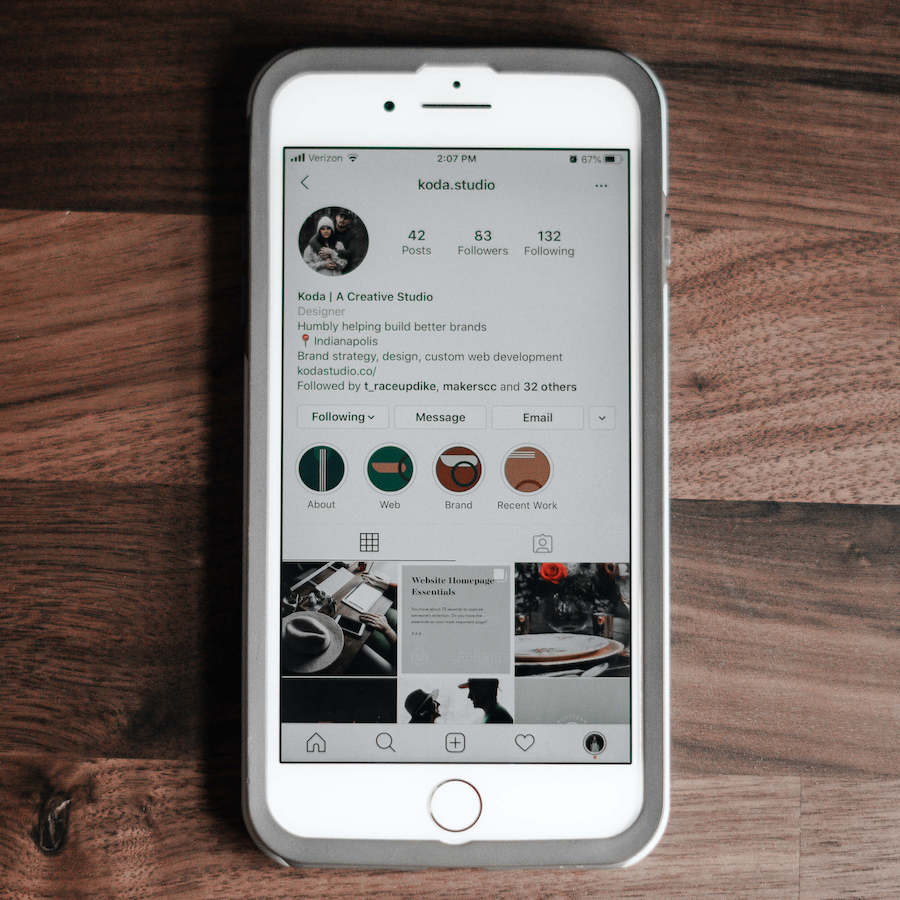
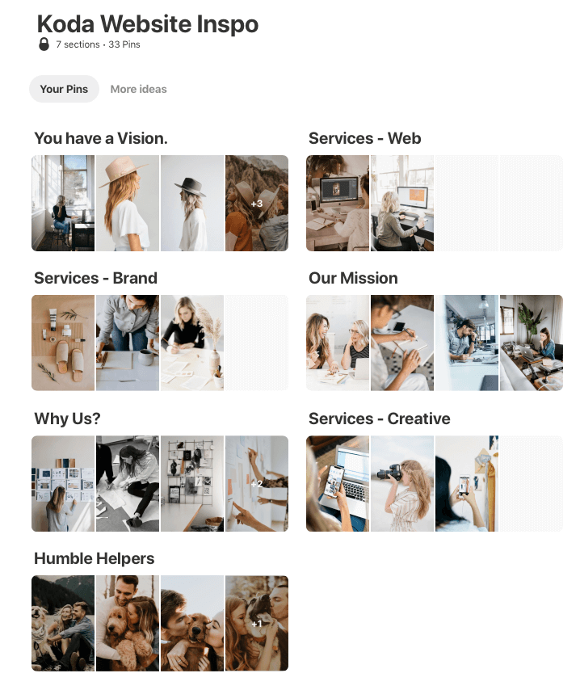

We’re in the age of social media marketing. You know your business’ Instagram should have your brand palette and cohesive photo filters. That’s the easy stuff, right? 

No matter how much thought you’ve put into your Instagram account, every time you’re supposed to post, you take 45 minutes to think of a decent photo idea to take then spend another 45 minutes to come up with a caption that (maybe?) resonates with your audience.

If you’re in this boat, you can attest to what happens. You stop posting, because this method isn’t sustainable. In fact, it’s incredibly stressful and regardless of the time you’ve spent, you still don’t think your feed demonstrates your brand. 

Believe us, we have been through this process. So, what’s the answer? Here are a few tips that we have found to easily curate and style an Instagram feed that markets your business and attracts potential customers. 

### 1. Your brand on social media should truly demonstrate the personality of your business

The content you share should be unique and original. This only happens when you let the personality of your business shine. This can’t happen through stock photos, reposted photos or trying to replicate another account’s style. Again, it’s not sustainable. Because that business doesn’t have the same personality as yours. By showing the meat and potatoes behind what makes your business unique, you not only make it easier for yourself, but are increasing credibility with your audience. People buy from people they know and trust. 

### 2. Plan the number of posts you need to have for the month 

Figure out how many days a week you would like to post on Instagram. Be realistic. If you have zero time right now, 7+ posts a week isn’t going to happen. Start out small and increase from there. If you want to post 3x a week, you need 12 content pieces for that month. Having a tangible number decreases stress, and allows you to focus on what needs to get done. 

### 3. Get inspired  

With a) in mind, create a mood/inspiration board on Pinterest with photo and post ideas. There are so many resources with prompts for you to follow along with and make your own. Again, MAKE IT YOUR OWN. Don’t copy what you see. Be inspired, and curate it to your business. 

### 4. Schedule content days and create a brief for your posts

Make social media a priority in your schedule! We schedule one day a week to plan a week’s worth of content. This day allows us to go through our work and get ready for online posting, as well as taking photos to keep our audience engaged. That way, we have a folder full of content that’s ready to go. During these days, we have a brief with what we want to create so that we’re not wasting time. From your inspiration board, pick photos you would like to gather inspiration from, and write out what you’re wanting to say with these photos. By having this with you when you shoot, you know exactly what you’re trying to accomplish.  

### 5. Make it really easy on yourself, and use a scheduling app. 

On the same day we create content, we plan it out on Later. This app makes it really easy to plan our grid out in advance to create a cohesive feed, as well as write captions and hashtags. We love that there’s a web version, because who wants to type out captions on a phone? And guess what. It’s free for up to 30 posts a month. That’s a winner in our book. Seriously, check it out. 

The final point we want to make is that you shouldn't get caught up in creating a “perfect” feed, because that isn’t possible. It is more important to post. Prioritize social media marketing and make time for it in your work schedule. By showing the genuine brand and faces behind your business, it is much easier to find inspiration for posts and your feed will naturally grow with you in the long run.

If you still are struggling with Instagram after trying a few of these, or simply don’t have the time, reach out! Social media content is one of our loves, and we’d be happy to talk to see if we can help you out. 
